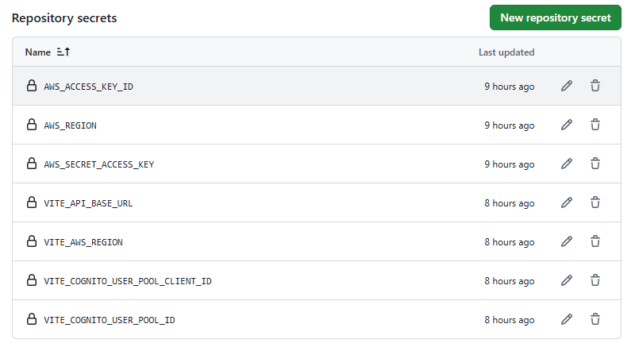
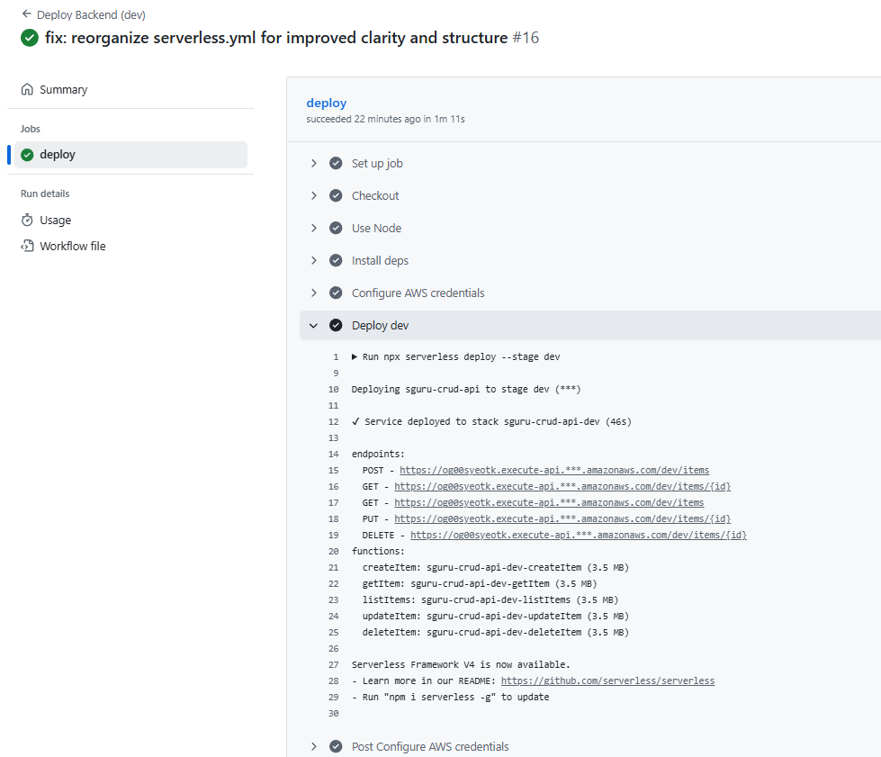
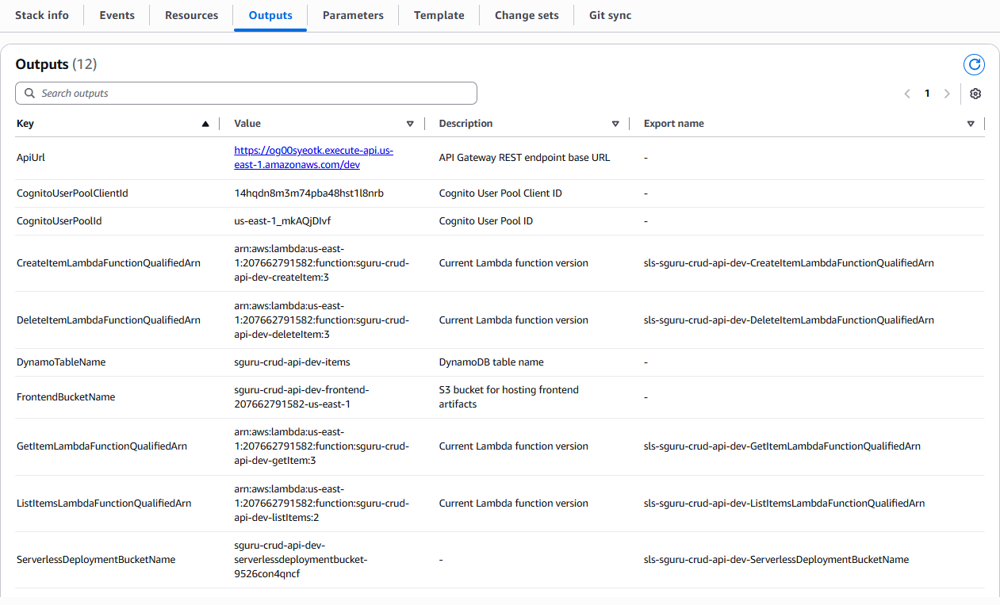
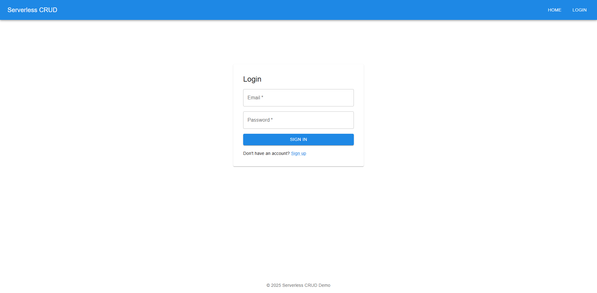

## Serverless Framework CRUD (AWS) + React Frontend (MUI + Cognito)  

End-to-end example that provisions an AWS API Gateway REST API with 5 Lambdas (CRUD + list) storing data in DynamoDB and protected by Cognito User Pool. A React frontend (Vite + MUI) integrates Cognito for auth and exercises all CRUD operations. Multi-stage (dev/prod) CI/CD is implemented with GitHub Actions.  

### Architecture
- **Backend**: API Gateway (REST) → Lambda (Node.js) → DynamoDB
- **Auth**: Cognito User Pool + Client (no secret)
- **Frontend**: React + MUI + Amplify Auth. Responsive for xs/sm/md/lg
- **CI/CD**: GitHub Actions deploys backend per stage; frontend to S3 + optional CloudFront

### Repo layout
- `backend/`: Serverless Framework app (Node.js 20)
- `frontend/`: React (Vite) + Material UI + Amplify Auth
- `.github/workflows/`: CI/CD workflows
- `docs/`: Drop screenshots and notes here

### Prerequisites
- AWS account and IAM user with permissions for CloudFormation, IAM, API Gateway, Lambda, DynamoDB, Cognito, S3, CloudFront.
- Node.js 18+ (20 recommended)
- Serverless Framework (`npm i -g serverless` or use `npx`)

### Backend (Serverless)
Key files:
- `backend/serverless.yml`: DynamoDB table, Cognito User Pool + Client, REST API routes, IAM permissions
- `backend/src/handlers/*.js`: CRUD handlers

Local deploy:
```bash
cd backend
npm ci
npx serverless deploy --stage dev
```
Outputs include:
- ApiUrl
- CognitoUserPoolId
- CognitoUserPoolClientId

Use these to set frontend env vars:
```
VITE_API_BASE_URL=<<ApiUrl>>
VITE_AWS_REGION=<<region used>>
VITE_COGNITO_USER_POOL_ID=<<CognitoUserPoolId>>
VITE_COGNITO_USER_POOL_CLIENT_ID=<<CognitoUserPoolClientId>>
```

### Frontend (React + MUI + Amplify)
```bash
cd frontend
npm ci
cp env.example .env # or create .env with VITE_* vars above
npm run dev
```
Open http://localhost:5173, sign up, confirm, login, then create/read/update/delete items.

Local deploy helper (optional):
```bash
# From repo root on Windows PowerShell
.\frontend\scripts\deploy-from-cfn.ps1 -Stage dev -Region us-east-1
```
This script reads the CloudFormation outputs to find the S3 bucket (and CloudFront id if present), builds the app, syncs to S3, and invalidates CloudFront when available.

### CI/CD (GitHub Actions)
- Backend:
  - `.github/workflows/deploy-backend-dev.yml` on push to `dev` → `sls deploy --stage dev`
  - `.github/workflows/deploy-backend-prod.yml` on push to `master` or `main` → `sls deploy --stage prod`
- Frontend:
  - `.github/workflows/deploy-frontend.yml` builds and deploys to S3 (+ optional CloudFront) on `dev` or `master/main`

Required GitHub Secrets:
- `AWS_ACCESS_KEY_ID`, `AWS_SECRET_ACCESS_KEY`, `AWS_REGION`
- Frontend build vars: `VITE_API_BASE_URL`, `VITE_AWS_REGION`, `VITE_COGNITO_USER_POOL_ID`, `VITE_COGNITO_USER_POOL_CLIENT_ID`
- Frontend deploy: `FRONTEND_BUCKET_DEV`, `FRONTEND_BUCKET_PROD`, optionally `CLOUDFRONT_DISTRIBUTION_DEV`, `CLOUDFRONT_DISTRIBUTION_PROD`

### Multi-stage
Stages derive from branch:
- `dev` branch → dev stage
- `master/main` → prod stage
Resources are named `${service}-${stage}-*` to avoid collisions.

Promotion workflow:
- Merge PRs to `dev` → auto deploy backend (dev) and frontend (dev bucket/CFN).
- Once verified, merge `dev` → `main` (or `master`) → auto deploy prod.

Manual stage deploys:
```bash
cd backend
npx serverless deploy --stage dev
npx serverless deploy --stage prod
```

Frontend manual deploy (PowerShell):
```powershell
.\frontend\scripts\deploy-from-cfn.ps1 -Stage dev -Region us-east-1
.\frontend\scripts\deploy-from-cfn.ps1 -Stage prod -Region us-east-1
```

### Authentication
- Cognito User Pool enforces auth on API routes via API Gateway Cognito authorizer.
- Frontend uses Amplify Auth for signup/login/confirm and attaches JWT on API requests.

### API Routes
- POST `/items` → create item
- GET `/items/{id}` → read item
- GET `/items` → list items
- PUT `/items/{id}` → update item
- DELETE `/items/{id}` → delete item
All routes require a valid Cognito JWT (attached by the frontend).  

### CORS
- Default: `*`
- Set a stricter origin by exporting `CORS_ORIGIN=https://your-frontend-domain` before deploy.

### Responsive & Design
- MUI responsive grid/cards; layouts adapt to xs/sm/md/lg.

### Tests
- Backend unit tests (Vitest):
  ```bash
  cd backend
  npm ci
  npm test
  ```
- Backend integration test (requires a test user in Cognito; configure `backend/.env`):
  ```bash
  # backend/.env keys:
  # API_BASE_URL, COGNITO_REGION, COGNITO_USER_POOL_ID, COGNITO_CLIENT_ID, TEST_USER_EMAIL, TEST_USER_PASSWORD
  cd backend
  npm run itest
  ```
- Frontend tests:
  ```bash
  cd frontend
  npm ci
  npm test
  ```

### Load testing (k6)
Generate a short‑lived JWT and run k6:
```bash
cd backend
node scripts/get-token.mjs > token.txt
k6 run \
  --env API_BASE_URL="https://<api-id>.execute-api.<region>.amazonaws.com/dev" \
  --env TOKEN="$(cat token.txt)" \
  --env VUS=10 --env DURATION=2m \
  loadtest/k6-crud.js
```
Optionally export a JSON summary with `--summary-export ./reports/k6-summary.json`.

### CloudFront toggle
- If your account doesn’t allow CloudFront creation, leave `CLOUDFRONT_ENABLED` unset/false. The stack will configure an S3 static website and output `WebsiteUrl`.
- To enable CloudFront, set `CLOUDFRONT_ENABLED=true` and redeploy. The stack outputs `FrontendUrl` and `CloudFrontDistributionId`. The frontend CI workflow will invalidate CloudFront automatically.

### Screenshots & Video
- Add CI/CD screenshots under `docs/ci-cd/` using these exact filenames (redact secrets):
  - `01-gh-actions-secrets.png` (Repo Settings → Actions → Secrets)
  - `02-gh-actions-backend-dev-success.png` (Deploy Backend dev run)
  - `03-gh-actions-frontend-dev-success.png` (Deploy Frontend dev run)
  - `10-cfn-outputs-dev.png` (CloudFormation dev stack Outputs)
  - `11-s3-frontend-bucket.png` (S3 bucket contents after deploy)
  - `12-apigw-stages.png` (API Gateway dev stage)
  - `13-cognito-user-pool.png` (Cognito pool + app client)
  - `20-frontend-live-login.png` (Live frontend home page)
  - `21-frontend-items-crud.png` (Items CRUD working)
  - `22-responsive-breakpoints-laptop.png`, `23-responsive-breakpoints-tablet.png`, `24-responsive-breakpoints-mobile.png` (Responsive views)

Example references in markdown:
```markdown




```
- Loom walkthrough link (update after recording):  
  `https://www.loom.com/share/REPLACE_WITH_YOUR_VIDEO_ID`

Suggested walkthrough topics:
- Repo layout, Serverless config, multi-stage naming
- CRUD handlers and DynamoDB access
- Cognito authorizer integration
- CI/CD flows (backend, frontend) and secrets
- Frontend auth flow and CRUD UI demo

### Troubleshooting
- Actions disabled: enable in repo/org settings; ensure path filters match your changes.
- Cognito permissions: the CI IAM principal needs `cognito-idp:*` basic CRUD on user pools/clients (see policy example in conversation).
- API Gateway logging role error: either grant IAM to create the role or keep `provider.logs.restApi: false`.
- CloudFront access denied / verification required: deploy without CloudFront (toggle off) or contact AWS Support to verify the account, then enable.
- S3 deep-link 404s: the app uses HashRouter to avoid rewrites; open `/#/` routes.
- Amplify not configured: ensure all `VITE_*` envs are set in CI and local `.env`.

### Frequently used commands
```bash
# Backend deploy/remove
cd backend && npx serverless deploy --stage dev
cd backend && npx serverless remove --stage dev

# Show stack outputs
aws cloudformation describe-stacks --stack-name sguru-crud-api-dev --query "Stacks[0].Outputs" --output table

# Frontend manual deploy (PowerShell)
.\frontend\scripts\deploy-from-cfn.ps1 -Stage dev -Region us-east-1
```

### Frequent commits
Suggested commit cadence (examples):
- chore(init): scaffold repo with backend, frontend, workflows
- feat(backend): add DynamoDB table and CRUD Lambdas
- feat(auth): add Cognito User Pool + API authorizer
- feat(frontend): add Auth (Amplify) and responsive UI
- ci(backend): add GHA deploy for dev/prod
- ci(frontend): add GHA S3/CloudFront deploy
- docs: update README with setup and screenshots

### Optional additions included
- Cognito signup/login, API protection
- Organized YAML and multi-stage variables
- Frontend deployment workflow (S3 + CloudFront)

### Cleanup
```bash
cd backend
npx serverless remove --stage dev
npx serverless remove --stage prod
```


